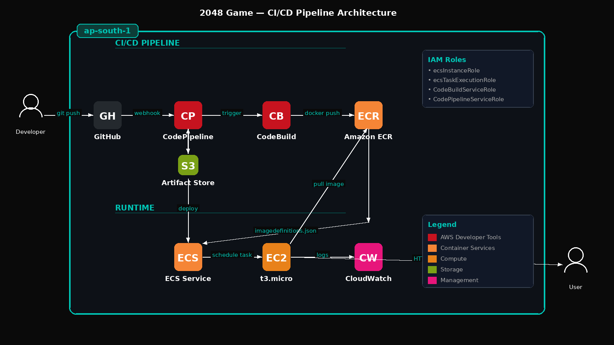

# 2048 Game — Containerized CI/CD Pipeline on AWS

A fully automated CI/CD pipeline that builds, pushes, and deploys a Dockerized 2048 game to AWS ECS (EC2 launch type) on every GitHub push — with zero manual intervention.

---

## What This Project Does

Every time code is pushed to the `master` branch, the pipeline automatically:
1. Detects the push via GitHub webhook
2. Builds a Docker image of the application
3. Pushes the image to Amazon ECR (private container registry)
4. Deploys the new image to a running ECS service on EC2
5. Serves the updated app to users — no SSH, no manual steps

---

## Architecture



```
Developer → GitHub → CodePipeline → CodeBuild → ECR → ECS (EC2) → Browser
```

**Flow:**
- **Source Stage:** CodePipeline detects a push to GitHub master branch
- **Build Stage:** CodeBuild runs buildspec.yml — builds Docker image for linux/amd64, tags with commit hash, pushes to ECR
- **Deploy Stage:** CodePipeline updates ECS service with new image via imagedefinitions.json
- **Runtime:** ECS schedules the container on a t3.micro EC2 instance, nginx serves the app on port 80

---

## AWS Services Used

| Service | Purpose |
|---|---|
| Amazon ECR | Private Docker image registry |
| Amazon ECS (EC2 launch type) | Container orchestration and scheduling |
| Amazon EC2 (t3.micro) | Compute instance running the ECS agent and containers |
| AWS CodePipeline | Pipeline orchestration (Source → Build → Deploy) |
| AWS CodeBuild | Managed build environment for Docker image creation |
| Amazon S3 | Artifact store between pipeline stages |
| Amazon CloudWatch | Build logs and container logs |
| AWS IAM | Roles and permissions for each service |

---

## Repository Structure

```
2048-cicd/
├── Dockerfile          # Container definition — nginx serving static files
├── buildspec.yml       # CodeBuild instructions — build, tag, push to ECR
├── index.html          # Game entry point
├── style/              # CSS files
├── js/                 # Game logic
└── meta/               # Meta assets
```

---

## Key Files Explained

### Dockerfile
```dockerfile
FROM nginx:alpine
COPY . /usr/share/nginx/html
EXPOSE 80
CMD ["nginx", "-g", "daemon off;"]
```
Uses the official nginx alpine image (~5MB). Copies all game files into the nginx web root. Exposes port 80 for HTTP traffic.

### buildspec.yml
Three phases:
- **pre_build:** Authenticates Docker to ECR using IAM role credentials
- **build:** Builds the image with `--platform linux/amd64` flag (required for Mac M-series developers targeting x86 EC2 instances), tags with both `latest` and the 7-character git commit hash
- **post_build:** Pushes both tags to ECR, generates `imagedefinitions.json` which tells ECS which image to deploy

---

## Infrastructure Setup

### ECR Repository
- Repository name: `2048-game`
- Visibility: Private
- Region: `ap-south-1`

### ECS Cluster
- Cluster name: `2048-cluster`
- Launch type: EC2 (not Fargate)
- Instance type: t3.micro
- AMI: ECS-optimized Amazon Linux 2

### Task Definition
- Family: `2048-task`
- Network mode: bridge
- Container name: `2048-container`
- CPU: 0.25 vCPU | Memory: 0.5 GB hard limit, 0.25 GB soft limit
- Port mapping: host 80 → container 80
- Logging: CloudWatch (`/ecs/2048-task`)

### ECS Service
- Service name: `2048-service`
- Desired tasks: 1
- Deployment type: Rolling update
- Min running tasks: 0%, Max: 200%

### CodeBuild Project
- Project name: `2048-build`
- Environment: Amazon Linux, Standard runtime, privileged mode enabled
- Environment variables: `AWS_DEFAULT_REGION`, `AWS_ACCOUNT_ID`
- Buildspec: `buildspec.yml` from repo root

### CodePipeline
- Pipeline name: `2048-pipeline`
- Source: GitHub (via GitHub App)
- Build: AWS CodeBuild (`2048-build`)
- Deploy: Amazon ECS (`2048-cluster` / `2048-service`)

---

## IAM Roles Created

| Role | Used By | Key Permissions |
|---|---|---|
| `ecsInstanceRole` | EC2 instance | Communicate with ECS control plane, pull from ECR |
| `ecsTaskExecutionRole` | ECS task agent | Pull images from ECR, write logs to CloudWatch |
| `codebuild-2048-build-service-role` | CodeBuild | Push to ECR, write CloudWatch logs |
| `AWSCodePipelineServiceRole-...` | CodePipeline | Trigger CodeBuild, update ECS service, read/write S3 |

---

## How the Pipeline Is Triggered

A GitHub App connection (AWS CodeConnections) watches the `master` branch. Any push automatically triggers the pipeline — no webhooks to configure manually, no polling delay.

---

## Key Decisions and Why

**EC2 launch type over Fargate:** Fargate charges per vCPU/memory hour immediately. A t3.micro EC2 instance is significantly cheaper for low-traffic workloads and learning environments.

**`--platform linux/amd64` in buildspec:** The development machine uses Apple Silicon (ARM). Without this flag, Docker builds an ARM image by default which cannot run on x86 EC2 instances — causing `CannotPullContainerError: no matching manifest for linux/amd64`.

**Commit hash image tagging:** Every build is tagged with both `latest` and the 7-character git commit hash (e.g., `135357e`). This means every deployed version is traceable back to an exact commit, and rollback is possible by deploying a previous image tag.

**`imagedefinitions.json`:** This file is the handoff between CodeBuild and the ECS deploy stage. It tells CodePipeline exactly which image URI to deploy. The container name inside this file must exactly match the container name in the ECS Task Definition.

---

## What a Production Version Would Add

- HTTPS via Application Load Balancer + ACM certificate
- Blue/green deployment via AWS CodeDeploy (zero downtime)
- Auto-scaling based on CPU/memory metrics
- CloudWatch alarms and SNS notifications on pipeline failures
- Separate staging and production ECS clusters
- Image vulnerability scanning enforcement in the pipeline
- Terraform or CloudFormation for infrastructure as code
- Secrets management via AWS Secrets Manager

---

## Cost

Running this project uses AWS credits/free tier:
- EC2 t3.micro: ~$0.012/hour
- ECR: first 500MB free
- CodeBuild: first 100 minutes/month free
- CodePipeline: first pipeline free

**Stop EC2 and set ECS desired count to 0 when not in use to avoid unnecessary charges.**
